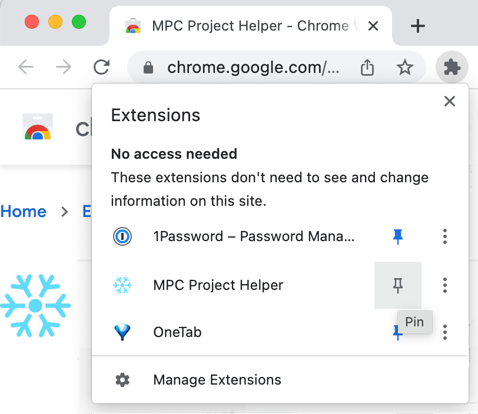

## For printing Arkham Horror homebrew and FFG PnP projects

The [MPC Project Helper](https://chrome.google.com/webstore/detail/mpc-project-helper/oigcfklkajlgkeblpngmbgjniiejabko) is a Chrome extension to streamline the creation and sharing of projects on [MakePlayingCards.com](https://www.makeplayingcards.com/).

Software development: **North101**

Evangelism, support, and AHLCG project file maintenance: **Coldtoes**

## **Installing the Extension**

1. Install the extension from the [chrome web store](https://chrome.google.com/webstore/detail/mpc-project-helper/oigcfklkajlgkeblpngmbgjniiejabko) by clicking **Add to Chrome**.
2. If, after installing the extension, you don't see the snowflake icon on the right side of your toolbar, click the puzzle piece icon to list your Chrome extensions and select the **Pin** icon next to MPC Project Helper to make the icon visible.
3. Go to [makeplayingcards.com](https://www.makeplayingcards.com/) in Chrome and log in to your account.
4. Click the snowflake icon to bring up the MPC Project Helper.
5. If you want to print a project that has already been set up, continue to the next step, [Loading a Project Someone Else Created].

If you have individual card images and you need to create your own MPC project from them, jump to [Creating a Project from Card Images].

##
## LOADING A PROJECT SOMEONE ELSE CREATED

## **Loading the Project from a**.json **file**

1. If you don't already have a project .json file, download the Arkham Horror homebrew or FFG PnP project(s) you want to print from [Coldtoes' Google Drive](https://drive.google.com/drive/folders/17xBgcvPOBx3w4_zzscvT9KKXf3u7nEKP?usp=drive_link). The [Index of Projects](https://docs.google.com/spreadsheets/u/0/d/1o2S68H-SMew3Jbyp6T_N1GA5iH4SswJgK1EMa2Bi2dE/edit) can help you see which projects are available and has links to more information on each project.
2. Click the **Add projects** button on the **Project** tab.

{width="5.85in" height="1.3859995625546806in"}

3. Browse to the location of your project .json file, select it, and click **Open**.

## Combining and Editing Projects (Optional)

As MPC charges a flat fee for a given number of cards, you can save money by combining several smaller projects for a lower cost per card than if you print them separately. You may even be able to print a smaller project for free by combining it with a larger project you are also printing, so check [MPC's pricing](https://www.makeplayingcards.com/design/custom-blank-card.html) to determine whether combining projects will be advantageous.

The bottom right corner will show your total card count out of the maximum project size on MPC (612 for Arkham Horror-sized cards). If your total exceeds the max, the extension will automatically split it into multiple projects.

1. You may select additional .json files to combine multiple projects into one. Use the draggable handles on the left to reorder projects as desired. 
2. If you wish to remove cards from an existing project, click the edit icon next to the project. Then use the trash icon to delete any cards you don't need.


3. If you wish to add or replace cards within a project, you'll need to make a second project file with the cards you want to add and then combine the two projects. See the [Combining and Editing Projects] section under [Creating a Project from Card Images] for more detailed instructions.

## Finalizing and Uploading Your Project 

1. When you are happy with the project, click **Upload**.
2. Choose your desired print settings. The following settings are recommended for Arkham Horror LCG:

   **Product:** Custom Game Cards (63 x 88mm).

   **Card Stock:** (S33) Superior Smooth (S33 is closest to FFG cards, but a little bit thicker. S30 Standard Smooth is slightly thinner but also acceptable, especially if you sleeve.)

   **Project name:** This is just for your own reference but may need to be shortened to fit MPC's max length. At the very least you can remove (card count).json. 

   Other settings can be left at the default.

   Click **Upload**.

3. On the **Success** screen, if you have combined multiple projects or made any edits, click the **Save as Project** button to save a .json file for your project. This will enable you to reload and edit it later if you need to make changes.
4. Now click **Open Project (1/****1****)**. This will open your project on MPC in a new tab. It may take a minute for the page to load so don't panic if initially all you see is a white screen.
5. If your project exceeded the max MPC size and were split into multiple projects, you will need to return to this tab to click the other **Open Project** buttons ( **2/x** , **3/x** , etc.) in order to access them on MPC.

## **Viewing Your Project on MPC**

1. You will see you have leapfrogged to Step 5 of MPC's project design, bypassing the first four time-consuming steps.
2. If you are loading a project that someone else created, even after giving the page time to load, you may see broken image icons instead of the card images you expect. This is due to the way MPC caches images — it is likely that if you printed the project it would print correctly (one person has tested this and it was successful), but this is an understandably big risk, given the cost of MPC printing and shipping.

   

   The way to resolve this problem is to contact the person who created the project file and ask them to click **Edit** on their saved project(s), allowing the images to reload. Once they have done this, you should be able to see the images in your account as well.

3. Check the disclaimer box and **Add to Cart** to purchase or **Add to Saved Projects** to save for later. 

## CREATING A PROJECT FROM CARD IMAGES

## Preparing Images for Upload

1. Prepare your images for upload by having one individual file for each unique card image.

   Minimum resolution for printing Arkham Horror-sized cards at MPC are 750 x 1050 px at 300dpi, with 36px bleed on all sides, so your final size should be at least 822 x 1122 px. See [MPC's bleed guidelines](https://www.makeplayingcards.com/pops/faq-photo.html) for more information and details on other card sizes.

   Bleed is an extension of the card art/design so that if the cut is slightly off you won't end up with an unprinted strip of white cardstock on one edge. You can automatically add mirrored bleed to cards in Strange Eons by downloading [this script](https://drive.google.com/file/d/1MpJ9UAUHsSkvmegd4WTy3-kX5AMB1GZ-/view?usp=share_link) and putting its path in the **Postprocess each image using a script** field of **Bulk Export** settings. Or you can use the Python script [bleedy](https://drive.google.com/drive/folders/1JcuCjJRC2p3jvw2FVMfsLN1qv0Oqv6Us?usp=drive_link) by Olivia Juliet and North101 to create mirrored bleed in bulk on individual images.

2. Ensure all cards are oriented vertically, and rotated so that the right edge of the front and the left edge of the back are both on the right. For Arkham Horror LCG horizontal cards (acts, agendas, and investigators), rotate the images so that lines of text on the front run from the bottom of the card to the top, and on the other side from top to bottom. (When previewing the front and back side by side, the bottoms of both faces should meet in the middle.)
3. The suggested naming pattern is to prefix your cards with a card number followed by the card or project name and to suffix all card fronts with -a (or -1 or -front) and backs with -b (or -2 or -back. The identical names (except for the suffix) allow the project helper to automatically pair the front and back of each card. The numerical prefix ensures the extension will organize the cards in the desired order.

   Your file names should now look like this:

   ```
   001-card-a.png
   001-card-b.png
   002-card-a.png
   002-card-b.png
   ```

4. If you have a common front or back card (e.g. AHLCG encounter or player back) you can leave off the number and name your files like this:

   ```
   back.png
   001-card-a.png
   002-card-a.png
   003-card-a.png
   003 card-b.png (this will take priority over back.png)
   ```

   An image with the name back will automatically be recognized as the default back and assigned to any fronts without an identically named back. Or you can select a default back after importing with the extension.

   Since the extension only allows a single default back, if you have more than one back image that is used on a number of your cards, you have two choices:

   - You can choose the one you have the most of (often the encounter card back) to use as the default back and make a copy of others (like player card backs) for each card front requiring it.
   - Or, you can upload all your player cards as one project with a default player back, then make a second project with the default encounter back, and, finally, combine the two projects into one. See [Combining and Editing Projects] for more details.

5. To print multiple, identical copies of a card, put a card count preceded by -x before the front/back flag:

   ```
   back.png
   001-card-a.png (prints a single copy of card 001)
   002-card-x2-a.png (prints two copies of card 002)
   003-card-x5-a.png (prints five copies of card 003)
   003-card-x5-b.png
   ```

## Uploading Images

1. Click the **Images** tab and then **Add Images** underneath.
2. Browse to the folder containing your images, use Command-A or Ctrl-A to select them all, and click **Open**.
3. Select a default back if one was not selected automatically.
4. Review the list to confirm that card fronts and backs are paired up as desired.

   You may manually change card counts, delete unwanted cards, or set a default card front/back at this point. Check the card count in the bottom right corner to confirm you have the expected number of cards.

5. Click **Add**. If any fronts and backs are paired incorrectly, you may choose a different image for either or both sides. You may also add additional images at this step, use the drag handles on the left to reorder cards, manually change card counts, or delete unwanted cards.
6. Optionally click **Preview** to view your project, and x to close the preview.
7. Click **Upload** and choose your desired card size. For Arkham Horror LCG, select **Custom Game Cards (63 x 88mm)**. Although you have the opportunity to set or change this in the next step, doing it here ensures you will get a warning if your image resolution is too low. Assuming this is a finalized project, check the **Upload project?** checkbox to create a project on your MPC account.
8. Name your project and choose your desired print settings. The following settings are recommended for Arkham Horror LCG: Product: **Custom Game Cards (63 x 88mm)**. Card Stock: **(S33) Superior Smooth** (S30 Standard Smooth is slightly thinner but also acceptable, especially if you sleeve.)
9. Click **Upload**. This may take a while for larger projects.
10. When you see the **Upload Success** message, change the default project.json to a more descriptive name (retaining the .json extension). Click **Save**.

   If you did not check the **Upload project?** checkbox, continue to [Combining and Editing Projects]. Otherwise skip to [Viewing Your Project on MPC].

## Combining and Editing Projects (Optional)

As MPC charges a flat fee for a given number of cards, you can save money by combining several smaller projects for a lower cost per card than if you print them separately. You may even be able to print a small project for free by combining it with a larger project you are also printing, so check [their pricing](https://www.makeplayingcards.com/design/custom-blank-card.html) to determine whether combining projects will be advantageous.

1. **Combining projects:** You may select additional .json project files to combine multiple projects into one. Use the draggable handles on the right to reorder projects as desired. The bottom right corner will show your total card count out of the maximum project size on MPC (612 for Arkham Horror-sized cards). If your total exceeds the max, the extension will automatically split it into multiple projects.
2. **Deleting and reordering cards:** If you wish to remove cards from an existing project or reorder cards within the project, click the edit icon next to the project. Then use the trash icon to delete any cards you don't need.
3. If you wish to reorder cards within multiple projects (i.e., mixing cards from , use the **Export** button to create a single project file, then clear the loaded projects, load your new combined file, and use the edit button to reorder.
4. If you are creating a project solely for the purpose of combining it with another project (for instance, if you changed a half-dozen cards in your project and want to replace them without re-uploading the entire project, or you created separate groups of player-backed cards and encounter-backed cards that you want to merge into a single campaign), you do not need to check the **Upload project?** checkbox on the Card Settings dialog.

   Instead, click only the green **Upload** button to upload the images to your MPC account without creating a project, then save your project file.

   Switch to the **Project** tab, click **Add projects,** and add both project files. You may remove cards from either project at this point.

   Click **Export** to create a third project which is a combination of your first two. Then, load the combined project, click the edit icon, and drag the cards from your second set to their desired positions. Re- **Export** your finalized project to save your finalized project file, then **Upload**.

## Viewing Your Project on MPC

1. Click **Open** to view your project on MPC. It may take a minute for the page to load so don't panic if all you see is a white screen, but this step will take substantially less time than the uploading step for images.
2. You will see you have leapfrogged to Step 5 of MPC's project design, bypassing the first four time-consuming steps.
3. If you wandered off for too long while the cards were uploading and the MPC page loads with only the header and footer but no cards after clicking **Open** , never fear; you won't have to redo the step or uploading each card image. Just go back to the extension and load the project file you just saved. You will then be able to open it successfully on MPC.
4. Check the disclaimer box and **Add to Cart** to purchase or **Add to Saved Projects** to save for later or to allow others to order using your project file.

## FAQ

### **Why should I install a Chrome extension to create MPC projects?**

MPC was not intended for free sharing of projects. Sharable projects were created to be sold in the MPC marketplace for a profit. Members of the Arkham Horror community do not want to violate [FFG's policy for community use of their IP](https://images-cdn.fantasyflightgames.com/filer_public/fa/b1/fab15a15-94a6-404c-ab86-6a3b0e77a7a0/ip_policy_031419_final_v21.pdf) by profiting off custom content, so they found a workaround to share MPC projects for free.

Unfortunately, this meant that any changes to a project changed it not just for the person placing the order but for everyone who viewed it thereafter. Projects were frequently found to be missing cards or have been partially overwritten by another campaign. Because creating a project on MPC is time-consuming, popular campaigns were often unavailable for months until someone had the time to recreate the project.

This extension was created both to streamline the project creation process and to make projects sharable without the potential to accidentally break the original project. In addition, it allows you to quickly combine multiple projects for cheaper printing, since the cost per card goes down with larger projects.

### If I'm not planning to share my project files, will I still find the extension useful?

Yes! You can save time by uploading images in bulk; the extension will automatically pair fronts and backs based on the filenames. MPC Project Helper then creates a json-formatted project file with links to the already uploaded images.

### Does the extension work with card printing sites other than MPC?

Yes. The extension also runs on [PrinterStudio.com](http://printerstudio.com/), [PrinterStudio.co.uk](http://printerstudio.co.uk/), and [PrinterStudio.com.hk](http://printerstudio.com.hk/).

Unfortunately the projects on Coldtoes' Google Drive are only compatible with MPC. If you need projects for other sites, [contact her] for assistance.

### I've uploaded cards with bleed but the red dotted line for MPC's "safe area" still shows parts of my cards cut off. Should I worry?

The red dotted lines indicating the safe print area may seem concerning, as sometimes part of the card title or other important elements may fall outside this line. However, this is an unlikely worst case scenario on any given edge of the card.

### I created an Arkham Horror homebrew campaign/investigator expansion/other cool card bling. How can I get my project included on Coldtoes' Google Drive for others to print?

Coldtoes would love to help make your project available for print! [Contact her] and share your cards and she'll make a project for the drive. (If you make the project yourself, someone will have to contact you to refresh it whenever they want to print it, so we've found it's easiest to have most projects for public use on a single account.)

### Who should I contact if I need help, find an error in one of the posted projects, or have suggestions to improve these instructions?

Coldtoes (she/her) can be found (in rough order of preference) as **@coldtoes** on the MythosBusters Discord server in the **#bling-your-game channel** , as [10coldtoes](https://discord.com/users/10coldtoes) through Discord DM, as [u/coldt0es](https://www.reddit.com/user/coldt0es) on r/arkhamhorrorlcg, and as [coldtoes](https://boardgamegeek.com/user/coldtoes) on BoardGameGeek.
